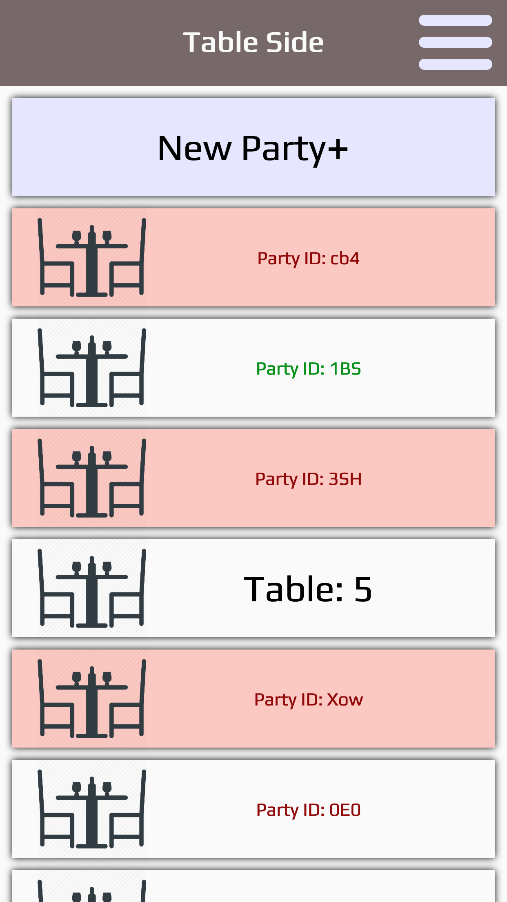
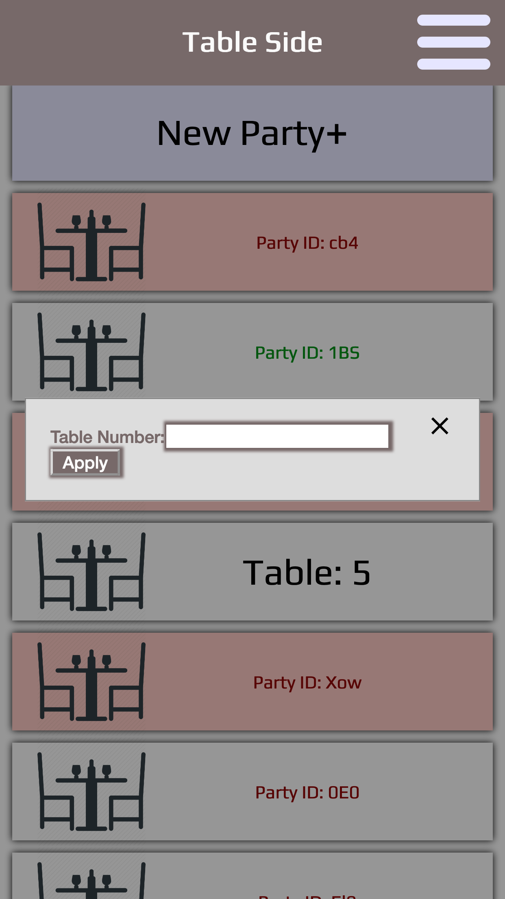
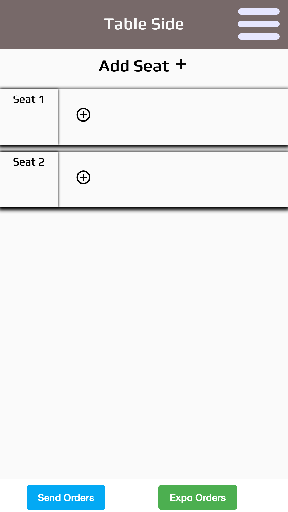
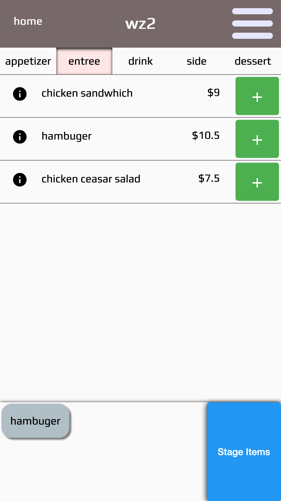
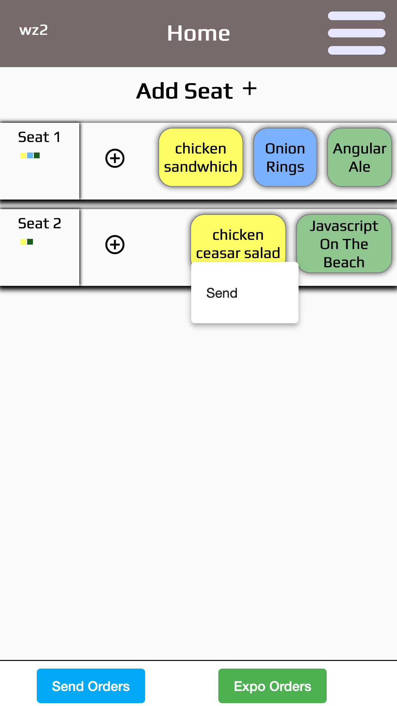
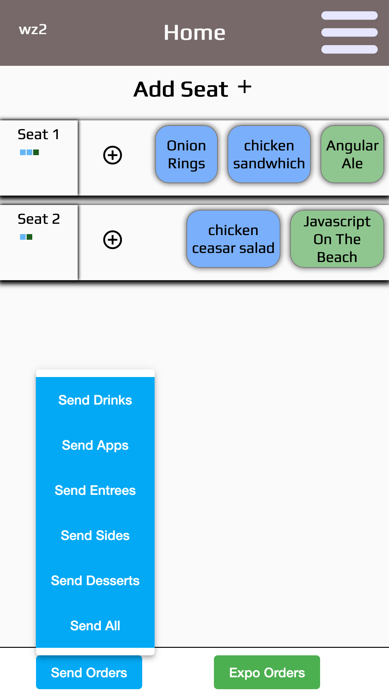
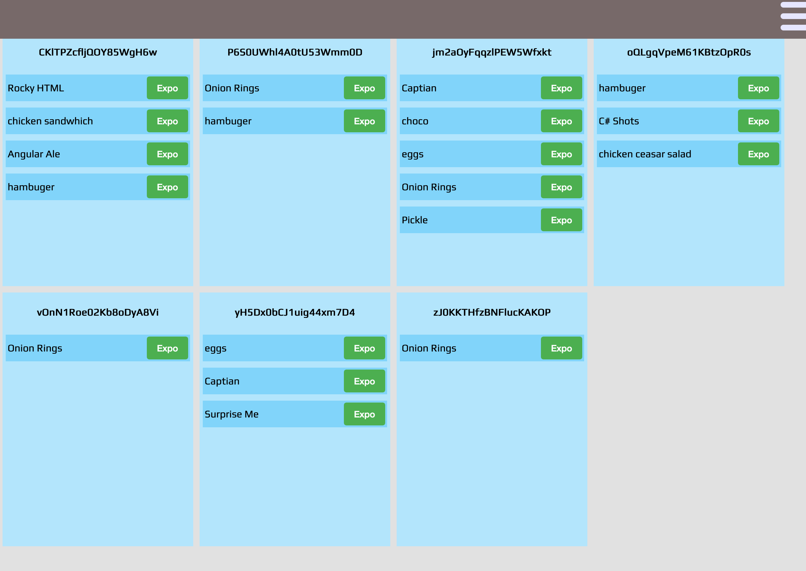
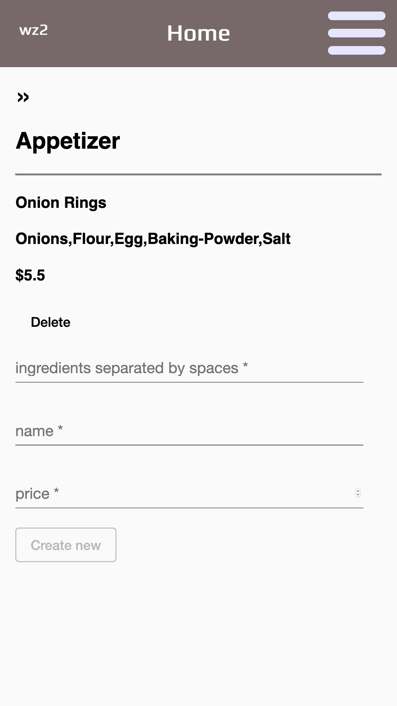

# <h1 align='center'>TableSide</h1>

> 
Getting to the Point of <em>Point of Sale</em>

TableSide is a proof-of-concept cloud based POS system designed for use on mobile devices.  This project was designed and built over three days as part of the <a href='https://www.epicodus.com/'>Epicodus</a> Angular module.

### TableSide Team:
- <a href="www.linkedin.com/in/dustin-herboldshimer">Dustin Herboldshimer</a>
- <a href="https://www.linkedin.com/in/fluentzap/">Todd Aden</a>
- <a href="www.linkedin.com/in/darrionkg">Darrion Gering</a> 
- <a href="https://www.linkedin.com/in/kerriann-walker-813198167/">Kerriann Walker</a>
- <a href='https://www.linkedin.com/in/mathew-akre29/'>Mathew Akre</a>

### deployment link goes here

### Project Specs

The goal of TableSide was to produce an app that would allow a server, through their phone or tablet, to complete the following steps of service:
##### MVP **(met)**
- new table creation 
- create ordered seats (on seat per person)
- add and edit orders by seat
- orders made through a realtime menu -- editable through an admin dashboard
- track/edit status of orders

##### Stretch Goals
- kitchen view and expedition functionality **(implemented)**
- close a table / basic cashout functions
- host view functionality

### Technology used
- Framework: Angular 8.1
- Database: Firebase (Firestore)
- Design: Material for Angular

### Tour
These first three images show the initial steps of creating a new table with 2 guests. Any number of seats may be created.  As of now, seats may not be deleted or re-ordered. The first image, or host view, has different colored cards.  Red indicates a new table that has no seats created yet...effectivly notifiying the server that the table has not been greeted yet.

    
    
    

By clicking on the '+' icon on each seat, a server may navigate the menu, adding items with the green button, and removing them by tapping on the item in the staging area at the bottom of the screen.  Staging the order will take redirect to the table, where they may add orders to another seat, or change the status of the staged order.  
There are three stages to each item.  'Staged'(yellow), 'Sent'(blue), and 'Expo'(green). A user can change the status of an order individually, or in a batch according to item category.  Notice the small grid of colored blocks beneath the seat numbers represent a quick view of the status of all items associated with that seat. Also notice that each seat can only display about three items -- each seat card can scroll to the right, allowing access to the overflowing items.

    
    
    

In a production build, a server would not only be able to change a 'staged' item to 'sent'.  Sent items are sent to a kithen view under their table id, where the order would be made and expedited to the table.  When the order has been run, an item's status would be set to 'Expo' from the kitchen view.  NOTE: The current build of TableSide does not have a direct link to this view.  To explore this view, use localhost:####/kitchen in your browser.

    

From the menu, admins may navigate to the menu editor, and create, edit, or delete menu items using two way data binding.  Changes are available to all users immediately.

    

## Installation instructions
If you would like to explore this project locally:

yourLocalDir: $ git clone https://github.com/FluentZap/TableSide.git

tableSide: $ npm install

Get your firestore key by loggin in (or creating) a new Google Firebase account, and create a new project using the Firestore database.  The api key can be copied from the project setting section.

The api-key should be exported from api_keys.ts as

    export const firebaseConfig {}

Start a dev server from your terminal:

tableside: $ ng serve

Navigate to `http://localhost:4200/`. The app will automatically reload if you change any of the source files.

## Further help

Contact any of the authors via an issue ticket on their forked TableSide repo.

To get more help on the Angular CLI use `ng help` or go check out the [Angular CLI README](https://github.com/angular/angular-cli/blob/master/README.md).

#### Licensed under MPL
#### Copyright (c) 2019 Dustin Herboldshimer · Todd Aden · Kerri Walker · Darrion Gering · Mathew Akre
